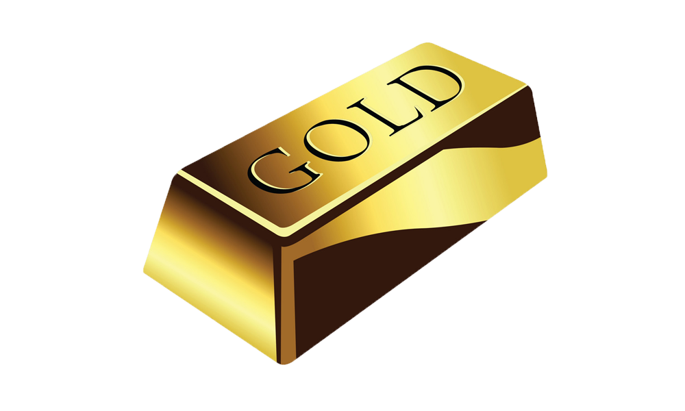
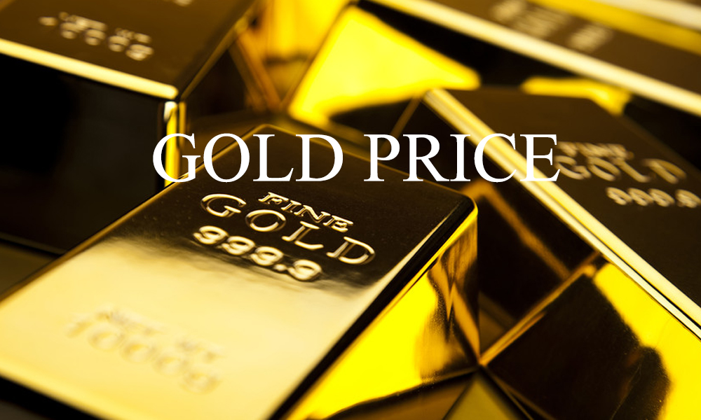

<h2><a href="">Gold Price Analysis</a></h2>
 

 ## คำอธิบายโปรเจค
     สวัสดึครับพวกเรากลุ่ม fontok sleepy จะทำโปรเจคเกี่ยวกันการวิเคราะห์ข้อมูลในเรื่อง Gold price ว่ามีมูลค่าขึ้นลงเท่าไหร ตั้งแต่ปี 
     1950-ปัจจุบัน โดยเราจะวิเคราะห์ข้อมูลของทุกปีว่าราคาทองนั้นมีมูลค่าต่างกันเท่าไหรจากปีที่ผ่านๆมา โดยจะแสดงผลออกมาเป็นกราฟ โดยเราจะเลือกใช้ภาษา
     Python ในการเขียนโปรแกรมดึงราคาทองของแต่ละปีออกมาเเละพอทลงกราฟ
 
 ## ใช้ข้อมูลจากที่ไหน 
    ข้อมูลจาก
  - https://l.facebook.com/l.php?u=https%3A%2F%2Fdatahub.io%2Fcore%2Fgold-prices%3Ffbclid%3DIwAR3LE3PlwHsM_rtkFAmR_XIcoh1Zhi3ve5Q_JLEYKTH1kvwfHDDCnK-WE3c&h=AT2kHV_7VPboSShQqzTH_7TKb1IabKIS3epzIUt5ZhfLrTNh9Q6R0dXDKAKzrfYQ4wXXYyu4BElx3gCY1JXLkRnrIxEQvx55zktm4fi0aI-KaQkAjUxAsEMmp_2ok3j1OSWRtg
  - https://datahub.io/core/gold-prices?fbclid=IwAR3LE3PlwHsM_rtkFAmR_XIcoh1Zhi3ve5Q_JLEYKTH1kvwfHDDCnK-WE3c
  
   รูปแบบข้อมูล : ไฟล์ข้อมูลนามสกุล .csv ซึ่งประกอบด้วย
 - Price : เงินในสกุลดอลล่าสหรัฐ(USD)
 - Years : มูลค่าทองตั้งเเต่ปี ค.ศ. 1950 - ปัจจุบัน
 
 ## 6 ปัจจัยที่กระทบราคาทองคำ
 - Demand & Supply
 สำหรับข้อแรกนั้นเป็นเรื่องพื้นฐานที่สุดสำหรับสินค้าทุกชนิดบนโลกใบนี้ก็คือเรื่องของ Demand Supply นั่นเอง เอาง่ายๆก็คือถ้าหาก 
 ทองคำนั้นหามาได้ง่าย+มีจำนวนมากเหมือนพลาสติก ราคาของทองคำนั้นก็จะต่ำ หรือ หากทองคำนั้นมีคนอยากซื้อมากราคาทองคำก็จะสูงขึ้นตามหลัก 
 Demand Supply ที่ใช้ได้กับสินค้าทุกชนิดบนโลก
 
 - Economic Data
 สำหรับประเด็นที่ 2 คือเรื่องของตัวเลขเศรษฐกิจต่างๆ คือถ้าหากเศรษฐกิจของโลกนี้ดูดี นักลงทุนก็จะไม่ค่อยสนใจทองคำมากนักเพราะนำเงินไปลงทุนในตลาดหุ้น
 น่าจะได้รับผลตอบแทน  ที่สูงกว่า ดังนั้นราคาทองคำก็จะตกลง ในทางกลับกันถ้าเศรษฐกิจของโลกหรือแนวโน้มเศรษฐกิจของโลกดูไม่ดี 
 ราคาทองคำก็มีแนวโน้มที่คนจะสนใจมาลงทุนเพิ่มขึ้น
 
 - Monetary Policy (นโยบายการเงิน)
 ข้อที่ 3 ก็คือเรื่องของนโยบายการเงินของธนาคารต่างๆ ทั่วโลก โดยเฉพาะประเทศใหญ่ๆ อย่าง USA เพราะเงินนั้นไหลจากที่ผลตอบแทนต่ำ
 ไปยังที่ผลตอบแทนสูงเสมอ ดังนั้นหากอัตราดอกเบี้ยเพิ่มสูงขึ้นก็มีแนวโน้มว่าคนจะนำเงินไปลงทุนในพวกพันธบัตรหรือเงินฝากต่างๆเพิ่มขึ้น 
 ซึ่งก็จะส่งผลกระทบต่อราคาทองคำในทางลบนั้นเอง เพราะคนก็อาจจะขายทองคำแล้วนำเงินไปฝากเพิ่มขึ้น
 
 - US Dollar movement
 ทองคำนั้นซื้อขายกันด้วย $ เป็นหลักดังนั้นถ้า US Dollar ด้อยค่าลง (อ่อนค่า) ราคาทองคำก็จะเพิ่มสูงขึ้นเอง
 
 - Inflation (เงินเฟ้อ)
 ข้อที่ 5 คือเรื่องของ Inflation หรือเงินเฟ้อ เงินเฟ้อที่เพิ่มขึ้นจะทำให้ราคาสินค้าต่างๆ ในโลกนี้เพิ่มขึ้น เช่นเดียวกับทองคำ ยกตัวอย่างให้เห็นภาพง่ายๆก็คือ 
 ราคาก๋วยเตี๋ยวข้างบ้านเมื่อ 10 ปีเท่าไรแล้วราคาตอนนี้เท่าไร ??
 
 - Uncertainty (ความไม่แน่นอน)
 มาถึงข้อสุดท้ายที่ส่งผลกระทบต่อราคาทองคำ นั่นก็คือเรื่องของ Uncertainty หรือความไม่แน่นอนของโลกใบนี้นั้นเอง เพราะว่าทองคำนั้นถือเป็น 
 safe heaven หรือ สินทรัพย์ปลอดภัยของโลกใบนี้ ดังนั้นหากเกิดความไม่แน่นอนเช่น เกิดการก่อการร้าย หรือ เกิดวิกฤตทางการเงิน การเมือง
 ราคาทองคำก็จะสูงขึ้นนั้นเอง
 
 ## Team Members
| รูป | รหัสนักศึกษา        | ชื่อ | นามสกุล |
|:-:| :-------------: |:----------:|:--------:|
 |  | 61070105 | นายนิธาน | ทรัพย์แก้วยอด |
 |  | 61070108 | นางสาวบุญญิสา | เลียวสิริไพโรจน์ |
 |  | 61070140| นายพันธวีร์ | คงสวัสดิ์  |
 |  | 61070246 | นายสุชานนท์ | วิโรจน์รัตน์  |
 
 ## Assistant Teacher
 - Instructor: Chotipat Pornavalai
  &nbsp;&nbsp;&nbsp;&nbsp;&nbsp;&nbsp;&nbsp;&nbsp;&nbsp;&nbsp;รายงานนี้เป็นส่วนหนึ่งของวิชา PROBLEM SOLVING IN INFORMATION TECHNOLOGY (06016314)
  เทคโนโลยีสารสนเทศ สถาบันเทคโนโลยีพระจอมเกล้าเจ้าคุณทหารลาดกระบัง 
